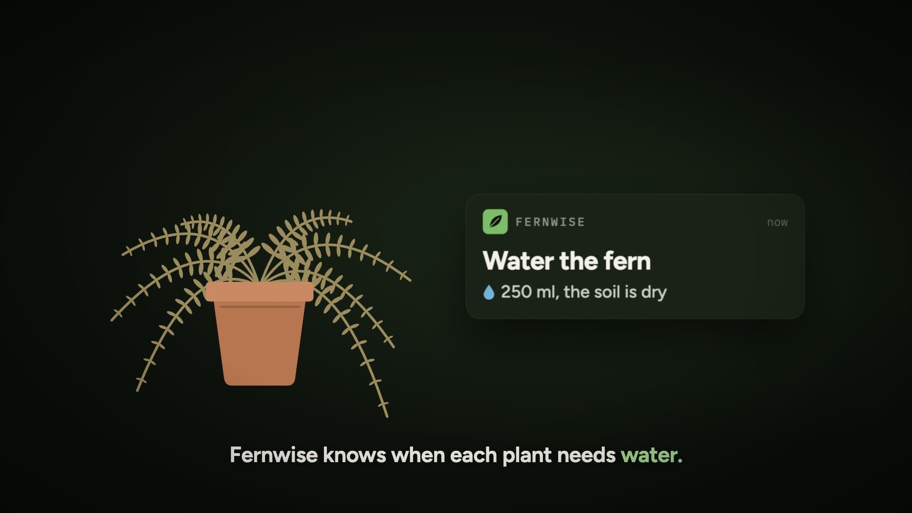
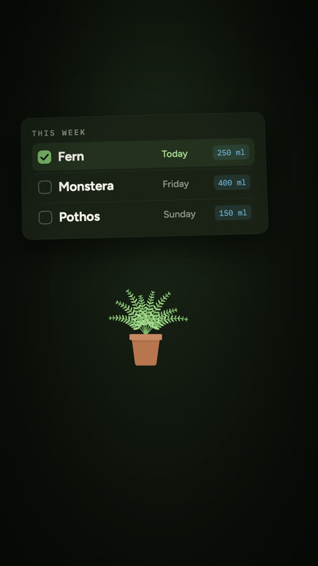

# product-film-skill

A [Claude Code](https://docs.claude.com/en/docs/claude-code) skill plus a [Remotion](https://www.remotion.dev) starter project for making short motion graphics product films. Ask Claude "make a product film for my product" and it works through a written process: a brief, three concepts and a critic pass, a claims ledger that sources every on-screen promise, a script, then ONE timeline file that drives the picture, the captions and the audio mix together. It ends with three cuts:

- a 16:9 master (1920x1080),
- a 9:16 vertical (1080x1920), recomposed for phones, that loops seamlessly,
- a short teaser cut from the vertical.

Every cut burns in karaoke captions for sound off viewing (set `captions: false` on a cut in `src/timeline.ts` for a clean picture).

Quality gates run before anything ships: timeline fit, caption timing, a claims check, safe zones, a frame check, loudness and format on the final files, and an independent review.





The example is an 18 second film for Fernwise, a made up houseplant app. It renders with no API keys at all: placeholder voice, synthesized music and effects, all clearly labelled.

## What is in the repo

| Path | What it is |
|------|------------|
| `skill/product-film/SKILL.md` | The skill: the process, the commands, the gates and the traps. |
| `skill/product-film/references/` | Craft notes and the independent review rubric. |
| `template/` | The Remotion starter: the example film, the timeline, and the pipeline scripts. |
| `install.sh` | Copies the skill and the starter into your Claude Code skills folder. |

## Prerequisites

- **Node.js 22.6 or newer** and npm (the pipeline reads `src/timeline.ts` directly with Node's type stripping).
- **ffmpeg and ffprobe** with libx264 and the `ebur128` filter (any recent build; `brew install ffmpeg` or your package manager).
- **Python 3.9 or newer**. The pipeline uses only the standard library; the optional stills step needs `pip install openai`.
- **Whisper**, for caption word timings, either:
  - [whisper.cpp](https://github.com/ggml-org/whisper.cpp) (`whisper-cli` on your PATH, for example `brew install whisper-cpp`) plus a model: `npm run whisper-model` downloads `ggml-base.en.bin` into `template/models/`; or
  - [openai-whisper](https://github.com/openai/whisper) (`pip install openai-whisper`, the `whisper` command).

  Without either, captions fall back to proportional timing, which is fine for the demo but not for a real film.
- **Optional, for real audio and images:** an [ElevenLabs](https://elevenlabs.io) API key and a voice of your own (voice, music, sound effects), and an [OpenAI](https://platform.openai.com) API key (background plates).
- **Optional, for the placeholder voice:** macOS `say` (built in) or `espeak-ng` on Linux. Without either, the placeholder voice is silence of the right length.

## Install

```bash
git clone <this repo's URL> product-film-skill
cd product-film-skill
bash install.sh
```

`install.sh` copies `skill/product-film` into `~/.claude/skills/product-film` and puts a clean copy of `template/` inside it, so the skill can start new films from anywhere. Use `bash install.sh --dest <folder>` (or set `CLAUDE_SKILLS_DIR`) for a different skills folder. To do it by hand:

```bash
cp -R skill/product-film ~/.claude/skills/
cp -R template ~/.claude/skills/product-film/template
```

## Quick start

Render the example first; it proves your machine has everything:

```bash
cd template
npm ci
npm run whisper-model   # whisper.cpp users only
npm run example         # half resolution, no API keys; about 3 to 5 minutes
```

The films land in `template/out/` (`master.mp4`, `vertical.mp4`, `teaser.mp4`) and contact sheets in `template/build/frames/`. `template/build/SOURCES.txt` lists where every asset came from; with no keys, everything audible is marked PLACEHOLDER. `npm run example -- --scale 1` renders at full resolution.

Then, in Claude Code, in an empty folder:

> Make a product film for my product. Here is the site: ...

Claude copies the starter, writes the brief, concepts and claims with you, and works through the pipeline.

## API keys

Keys are read from environment variables only; nothing is stored in the project.

| Variable | Used for |
|----------|----------|
| `ELEVENLABS_API_KEY` | Voice (text to speech), music and sound effects. |
| `ELEVENLABS_VOICE_NARRATOR` | The example narrator's voice id. Each speaker names its own variable in `film.config.json`. |
| `OPENAI_API_KEY` | Optional photographic background plates. |
| `OPENAI_IMAGE_MODEL` | The image model for plates (default `gpt-image-1`). |
| `PF_NO_KEYS=1` | Force placeholders even when keys are set. |
| `WHISPER_CPP_BIN`, `WHISPER_MODEL`, `WHISPER_PY_MODEL` | Point the words step at a specific whisper binary or model. |

## The pipeline

Every step is an npm script in `template/`:

| Command | What it does |
|---------|--------------|
| `npm run voice` | Voices every line (ElevenLabs, or a labelled placeholder) and trims the silence. |
| `npm run words` | Word timings from whisper, aligned to the caption text, with pause onsets corrected. |
| `npm run music` | A score from the timeline's music plan, one section per act (`--takes 2`, `--use N`). |
| `npm run sfx` | Sound effects from the prompts in `film.config.json`. |
| `npm run stills` | Optional background plates from an OpenAI image model. |
| `npm run render -- <master or vertical>` | Renders a cut through the Remotion Node API (`--scale`, `--still`, `--probe`). |
| `npm run mix -- <cut>` | Mixes voice, effects and music from the timeline, then sets loudness and true peak. |
| `npm run teaser` | Cuts the teaser from the rendered vertical and its mix. |
| `npm run finish -- <cut>` | The delivery encode, measured on the final file. |
| `npm run cuts` | All of the above for all three cuts, then the final check (`--scale 0.5` for previews). |
| `npm run check:timeline` | The measured audio still fits the acts, the cuts and the teaser. |
| `npm run check:captions` | Every word lights when it is heard; reading speed; nothing stale. |
| `npm run check:claims` | Every promise is in the claims ledger with a source; no banned words. |
| `npm run check:safe -- <cut>` | Renders a content only probe and fails anything outside the safe zone. |
| `npm run check:final` | Format, duration, faststart, loudness and true peak of the delivered files. |
| `npm run frames -- <file>` | A contact sheet (and single frames with `--at`) to look at. |
| `npm run studio` | Remotion Studio, to scrub the film while building scenes. |

## Cost

With your own keys, a film of about a minute costs about a dollar or two in API calls: a dozen voice lines, a few music takes, a handful of sound effects and a few optional images. On an ElevenLabs subscription the audio draws from your monthly credits instead. Rendering is local and free.

## Remotion license

Remotion is not MIT licensed. It is free for individuals, for-profit companies with up to 3 employees, non-profits, and for evaluation; larger for-profit companies need a Remotion company license. Read the [Remotion license](https://www.remotion.dev/license) and, if it applies to you, get a company license at [remotion.pro](https://www.remotion.pro/license) before you render with this starter.

## License

This repository's own code and text are under the MIT license (`LICENSE`). The bundled fonts, Figtree and IBM Plex Mono, are under the SIL Open Font License 1.1 (license texts in `template/public/fonts/`). Remotion and the other npm dependencies keep their own licenses.
